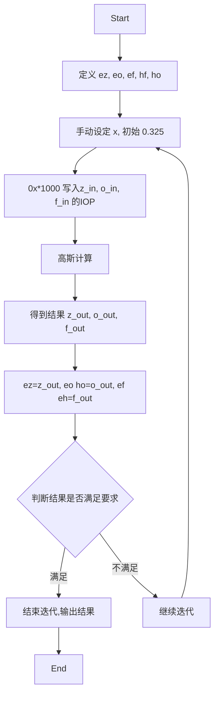

# ywq

YWQ's script

## 流程图

```mermaid
graph TB
A[Start]-->B[定义 ez, eo, ef, hf, ho]
B-->C[手动设定 x, 初始 0.325]-->D[0x*1000 写入z_in, o_in, f_in 的IOP]
D-->E[高斯计算]-->F[得到结果 z_out, o_out, f_out]
F-->G[ez=z_out, eo ho=o_out, ef eh=f_out]
G-->H{判断结果是否满足要求}
H-->|满足|I[结束迭代,输出结果]
H-->|不满足|J[继续迭代]-->C
I-->K[End]
```

---

## 待定

- 每次迭代前，都需要手动输入 X ？

- 判断循环终止的条件 ？
- 0x*100000 是什么

---

## 相关文档

