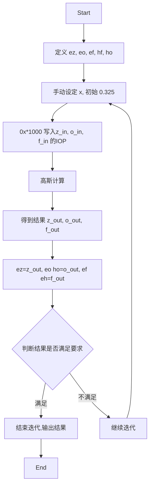

# ywq

Y W Q's script

## 流程图

---

## 待定

- 每次迭代前，都需要手动输入 X ？

- 判断循环终止的条件 ？
- 0x*100000 是什么东西，好奇怪的值
- IOP 的值每次都固定为 iop(3/107=0x*1000000,3/108=0x*100000) 吗？
- 每个输入文件的 IOP 都一样吗？
    - 既然 IOP 是输入文件的内容，按理说每次运算只会改变输出文件，不会改动输入文件，那么输入文件只需设定一次即可，为何要进行循环迭代 ？

---
## 已解决
- x 只需设定一次

---
## 相关文档

